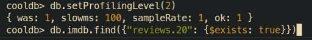

# ДЗ 2

## Установка монги

Я сделал devcontainer, к которому можно удобно подключаться из VSCode, и поставил на рута надежный
пароль `hackme`. Описание контейнера лежит в [.devcontainer/](.devcontainer). Все элементарно.
После этого подключился через `mongosh`, сделал тестовую базу данных `cooldb` и коллекцию `misc`.

 

Могодб работает. Это успех.

## Импорт данных

Мне понравился [вот этот датасет](http://ai.stanford.edu/~amaas/data/sentiment/). Скачивался он
целую вечность, зато теперь можно будет проанализировать обзоры на фильмы. К большому сожалению,
датасет устроен как-то совсем бессмысленно. Структура папок такая:
```
train/
    pos/
        0_10.txt
        1_2.txt
        ...
    neg/
        0_4.txt
        1_3.txt
        ...
    urls_pos.txt
    urls_neg.txt
test/
    ...
```
Есть папки `pos` и `neg` с положительными и отрицательными обзорами, внутри них файлы имеют названия
`{id}_{score}.txt`, где `id` - номер обзора, а `score` - оценка фильма по 10-балльной шкале. Внутри
самих файликов написаны тексты обзоров. В `urls_{pos, neg}.txt` лежат ссылки на соотв. фильмы на
IMDB. Каждому обзору соответствует ссылка из файла `urls_{pos, neg}.txt`, которая написана на
строке с номером как `id` обзора. Ссылки могут повторяться, разными фильмам может соответствовать
несколько положительных и отрицательных обзоров. Понятно, что в таком виде датасет невозможно
импортнуть в монгу, поэтому я его переделал с помощью [скрипта](convert_imdb.py).


Получилось 2 файлика `train.json` и `test.json`, в которых написано примерно следующее. Здесь
айдишники - это айдишники самих фильмов, которые я получил из ссылок на IMDB.

```json
[
  {
    "id": 93429,
    "reviews": [
      {
        "review": "I rented this some years ago, the video store had only VHS at the time. Straight to video was hitting it's strides (you know, where the box covers use the same font and color schemes of successful films).I didn't know what to expect other than what was printed. First thing I thought while watching was \"what the hells' wrong with the sound?\"-Obviously there was no dialogue dubbing. Words echoed, so I stopped munching on whatever I had to pay closer attention-mind you there's no Shakespeare here!,just simple talk. The story is simple enough, boy meets girl etc.. What struck me as humorous and heartfelt was, the people in the movie didn't seem like caricatures written into the story,but rather non-actors plucked temporarily from their real jobs(uniforms included). All the while, you begin to sense what the filmmaker is after,then see that there are no attempts at cheap humor(people hurting their privates,using vulgarities this couldn't have hurt the marketing. There was something honest about it. I thought if they'd have a bigger budget then it would have been better, which i'm sure they considered daily,but, they went ahead and made it. This, I felt, was what independent film-making is all about.The word \"Indy\", is thrown around as if it's a Genre..Ha!..that's funny!",
        "score": 8,
        "type": "pos"
      },
      {
        "review": "This is a cute and sad little story of cultural difference. Kyoko is a beautiful Japanese woman who has run to California to escape from a failed relationship in Japan. Ken is a Japanese American manual laborer with aspirations of rock and roll stardom but little concrete to offer a potential partner. Kyoko \"marries\" Ken in order to be able to stay permanently in the U.S., with the understanding that although they will live together until she gets a \"green card\" the marriage will be in name only. It soon develops that the parties are not on the same wavelength - or perhaps in the same \"time zone\", hence the title of the movie. As an immigration attorney I have seen such \"arrangements\" take on a life of their own, so I was pleased to see how well the filmmaker developed the dramatic possibilities of this situation.",
        "score": 7,
        "type": "pos"
      },
      ...
    ]
  },
  ...
]
```

В таком виде уже легко импортнуть в могу через `mongoimport`.


Айдишники внутри `test.json` и `train.json`, конечно, повторялись, поэтому после импорта в БД одному
айди может соответствовать несколько документов, но мне реально пофиг. Не хочется эти 2 джсона
мержить.

## CRUD

### R

Мне было интереснее всего посмотреть, сколько есть противоречивых фильмов. Поэтому я сделал
запрос, в котором считается число фильмов, у которых одновременно есть отзывы с оценкой `1` и
отзывы с оценкой `10`. Оказалось, что таких фильмов вообще большинство. В принципе, неудивительно.


### C

Но это все равно как-то бессмысленно. В базе не хватает отзыва на фильм номер `666666`! Решил его сам
дописать.


Вот так лучше

### U

Но по одному отзыву, конечно нельзя оценивать фильм, поэтому я проапдейтил базу, добавив еще
один отзыв эксперта.


Вот, когда много людей независимо оставляет отзывы, становится проще выбирать фильмы.

### D

После этого я решил, что информацию про фильм номер `666666` вообще лучше стереть. Вместе со всеми
достаточно большими айдишниками, ну, просто потому что вот так.


К сожалению, на такой маленькой базе тяжело мерить перф, поэтому потом пришлось импортнуть все
обратно.

## Индекс

Я очень постарался (нет) придумать пример, в котором непонятно, будет ускорение от индекса или не
будет.  Хочется соптимизировать такой запрос: ищем документы, в которых достаточно много обзоров.


Включаем профилировщик, и видим, что такой запрос работает целых 2 миллисекунды и делает обычный
`COLLSCAN`.  Получается, надо ускорять.




К сожалению, в монге нельзя построить индекс по размеру массива в объекте, поэтому был использован
грязный хак. Я добавил `n_reviews`, в котором записано число обзоров на фильм и построил индекс
уже по этому ключу.


Опять смотрим в профилировщик.


Видно, что запрос использует индекс и теперь отрабатывает за 0 миллисекунд. То есть он ускорился
в бесконечность раз. Это победа.
