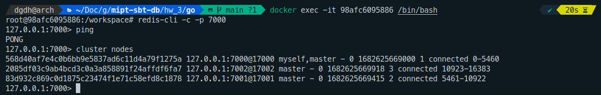
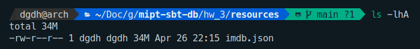
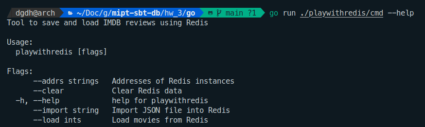
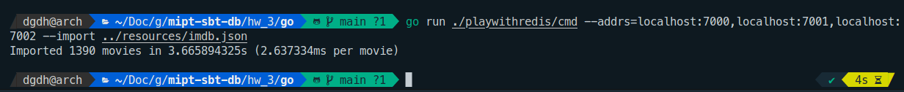
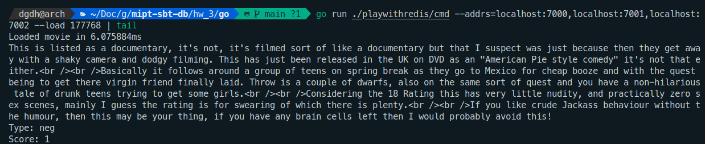
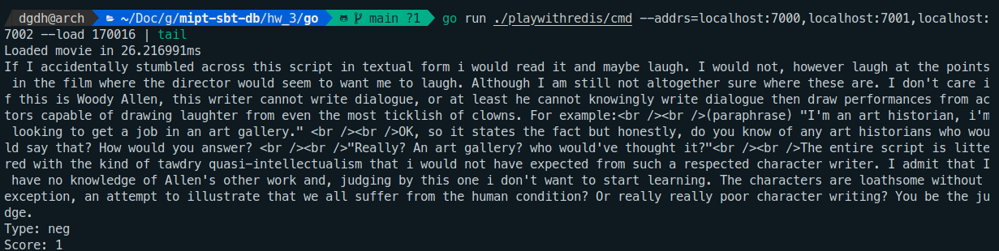

# ДЗ №3

## Установка и настройка кластера Redis

Люблю контейнеры и не люблю ставить ничего в хост-систему, поэтому кластер решил развернуть в
докере. Он будет состоять из трех мастер-нод, работающих внутри одного контейнера. (Можно было
бы сделать разные ноды в разных контейнерах, чтобы смоделировать несколько физических машин,
но процесс конфигурации от этого никак не поменяется, а настраивать будет более муторно.)

Все конфиги лежат в папке [redis](redis/). Разным нодам соответствуют поддиректории `7000`, `7001`
и `7002` - по номеру порта, на котором работает инстанс. При старте контейнера запускается скрипт
[run-cluster.sh](redis/run-cluster.sh). Он запускает три ноды, используя конфиги из их директорий,
переводит их в режим кластера и засыпает.

Конфиги нод практически одинаковые, отличаются только номерами портов. Вот, например,
[7000/redis.conf](redis/7000/redis.conf). Здесь затюнены два таймаута: по прошествии `timeout`
времени отключается неактивный клиент, а после `cluster-node-timeout` времени неотвечающие ноды
кластера считаются мертвыми. `timeout` нужен только для красоты, потому что мы будем аккуратно
закрывать соединения на клиентах, используя [defer](https://go.dev/tour/flowcontrol/12) в Go. 

Чтобы поднять кластер, нужно выполнить `(cd redis/ && docker compose up -d)`. Насколько я понимаю,
в такой конфигурации кластер не отказоустойчив, т.к. данные шардируются между мастер-нодами,
но не реплицируются. Чтобы это пофиксить, можно было бы выделить еще три слейв-ноды на портах
`7003`, `7004`, `7005` и указать внутри [run-cluster.sh](redis/run-cluster.sh) флаг
`--cluster-replicas 1`. Но мы не будем усложнять.

После запуска кластера можно посмотреть, как распределены слоты между нодами.

## Клиент

Мы будем использовать датасет из предыдущего задания: [imdb.json](resources/imdb.json). Это база
отзывов на фильмы с IMDB, она весит 34 мегабайта.

Все взаимодействие с редисом будет происходить через [go-redis](https://github.com/redis/go-redis).
Я написал на Go небольшой [клиент](go/), который умеет удалять все ключи из редиса, импортировать
датасет и читать отдельные фильмы. Чтобы запустить его, нужно сделать
`(cd go/ && go run ./playwithredis/cmd --addrs=localhost:7000,localhost:7001,localhost:7002)`.

## Иморт данных

Схема данных примерно такая.
- Есть ключ `reviews:sequence`, через который генерируются айдишники для ревью. Когда хотим
  добавить новое ревью, делаем `INCR` этого ключа.
- По ключам `review:<id>` хранятся хеш-сеты с полями `score` - оценка фильма по 10-балльной шкале,
  `type` - положительное или отрицательное ревью и `text` - тело ревью.
- Для каждого фильма есть ключ `movie-reviews:<id>`, айдишники фильмов берутся из JSON-файла.
  По ключу хранится список айдишников ревью для данного фильма.
`zset` сюда как-то не вписывается, но зато использовали `list`, `hset`, строки и числа.

Процесс импорта выглядит как на скришоте, код лежит в [redis.go](go/playwithredis/redis.go).

Импорт можно ускорить, используя пайплайн редиса, тогда на загрузку всех
фильмов будет всего один раунд-трип по сетевым интерфейсам, а не столько, сколько есть фильмов.
Но данных не очень много, поэтому оставляем как есть.

## Чтение

Скорость чтения зависит от количества/длины ревью, которые есть у фильма, а длины несбалансированы.
Поэтому latency чтения получается разным в зависимости от того, какой фильм хотим выбрать. Например,
вот два результата.

У айди `170016` ревью гораздо больше, чем у `177768`. Этот результат говорит о том, что в датасете
есть много фильмов, у которых суммарная длина ревью маленькая.

