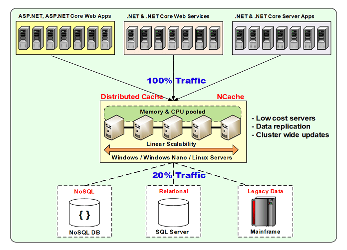
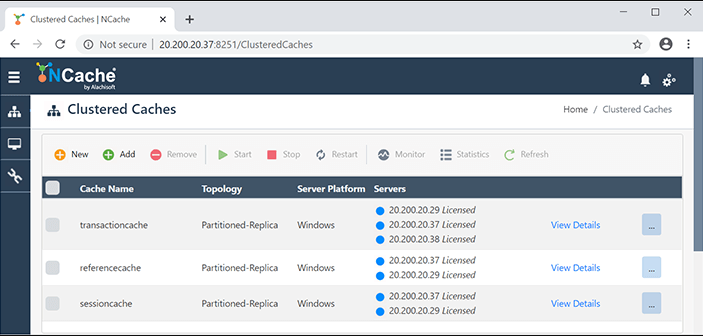
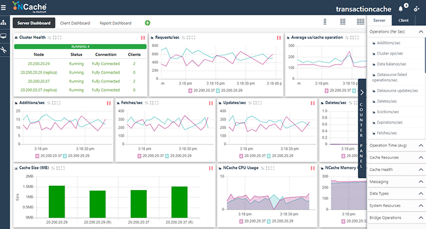
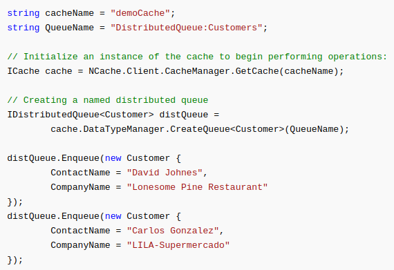
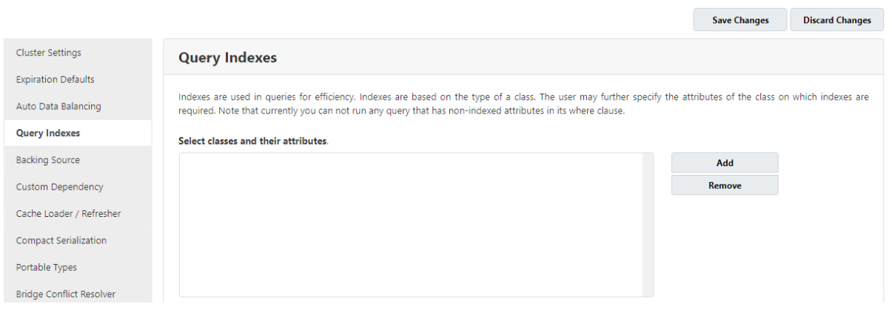
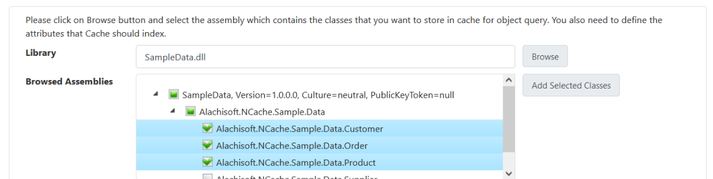
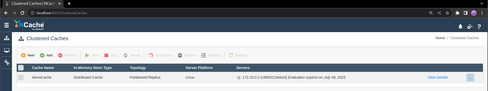
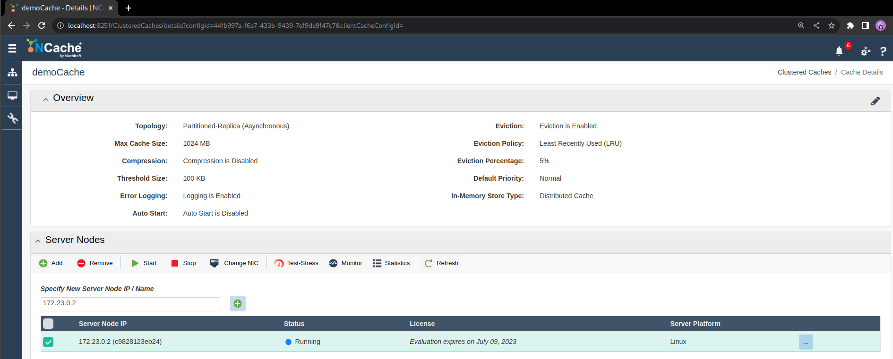
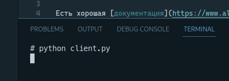

# ДЗ №4 (NCache)

## Суть

NCache - распределенный кэш, который в основном используется приложениями, написанными на
Microsoft .NET. Он представляет собой in-memory хранилище произвольных данных, которое
шардируется и реплицируется между несколькими серверами кластера. Возможные варианты применения:
- снижение нагрузки на медленную БД
- кэширование пользовательких сессий (в случае веб-приложений)
- просто key-value хранилище для произвольных данных
- рассылка сообщений в модели pub-sub

Есть красивая картиночка с возможной архитектурой приложения, использующего NCache. Большая
часть запросов обрабатывается быстрым кэшом, и только 20% реально стучатся в базу.

Утверждается, что NCache умеет линейно масштабироваться. Чем больше серверов в кластере,
тем выше пропускная способность кэша. При этом возможно простое изменение конфигурации кластера 
с нулевым downtime-ом.

## История развития

Про историю известно не очень много. Первый релиз NCache был в 2005 году.  Основателем считается
некто Iqbal Khan, информацию о нем можно прочитать на соответствующей
[страничке](https://www.alachisoft.com/company/management.html) официального сайта. Текущая версия
NCache - v5.3 SP1, последний релиз был в сентябре 2022 года. С развитием .NET Core также приобрела
популярность версия NCache для линукса. Существует как enterprise так и community open source
решение. Исходники последнего выложены на [гитхабе](https://github.com/Alachisoft/NCache).

## Инструменты для взаимодействия

Взаимодействие с кеш-сервером происходит в формате [Protobuf](https://protobuf.dev/), поэтому
клиентская часть легко может быть написана на чем угодно. Существует
[API](https://www.alachisoft.com/resources/docs/ncache/dotnet-api-ref/) для .NET-приложений,
есть клиенты для [Python](https://pypi.org/project/ncache-client/),
[Java](https://mvnrepository.com/artifact/com.alachisoft.ncache),
[Scala](https://www.alachisoft.com/de/resources/docs/ncache/scala-api-reference/com/alachisoft/ncache/scala/client/),
[Node.js](https://www.npmjs.com/package/ncache-client?activeTab=readme).

Для администрирования и мониторинга нагрузки предусмотрены красивые web-интерфейсы.

## Database engine

В NCache используется свой собственный database engine, отвечающий pub-sub и хранилище данных.

## Примеры запросов

Поскольку у NCache нет полноценного языка запросов, а есть только API для некоторых ЯП, запросы
сводятся к тому, чтобы написать код. Вот, например, создание очереди с использованием API для .NET.
При вызове методов у `cache` и `distQueue` под капотом происходят RPC-запросы к кэш-серверу.

Больше примеров запросов - в разделе [демонстрация работы](#демонстрация-работы)

## Распределение файлов по разным носителям

В контексте NCache пункт не имеет большого смысла, т.к. хранилище данных вообще in-memory
(поддерживается создание бэкапов на диске). Но 100% можно использовать несколько плашек оперативной
памяти =)

## Детали реализации

NCache написан на .NET, по большей части на C#. Соответственно вся инфраструктура вокруг СУБД
достаточно сильно привязана к Windows (что огорчает). Есть версия чисто для Windows, рабтающая на
обычном .NET, есть линуксовая версия на [.NET Core](https://github.com/dotnet/core).  

## Поддержка индексов

В NCache есть [индексы](https://www.alachisoft.com/resources/docs/ncache/admin-guide/indexing.html),
но они устроены необычно. Есть индексы для поисковых запросов, индексы для вытеснения объектов из
кэша и индексы для удаления объектов по истечении таймаута. Индексы для запросов бывают статические
и динамические.  Статические индексы можно настраивать для объектов с фиксированной схемой данных,
т.е .NET-классов, у которых заранее известны все поля. Динамические индексы - для всех остальных
объектов. Они конфигурируются в рантайме по мере необходимости, и их не нужно настраивать вручную.  

Смысл индексов для вытеснения объектов в том, что можно настроить разные политики:
- вытеснение объектов, которые реже всего используются
- вытеснение объектов, которые использовались очень давно
- вытеснение с использованием кастомных приоритетов объектов.

Статические индексы можно настроить из web-интерфейса либо с использованием API для какого-нибудь ЯП.
Ниже пример создания индекса для объектов класса `Customer`, `Order` и `Product`. При построении
индекса в данном случае будут использоваться все поля объектов, но это можно настраивать.

## Процесс выполнения запросов

Для NCache не существует понятия плана запроса. Поскольку нет языка запросов, а есть только API,
ничего не надо парсить, достаточно десериализовать сообщения из формата Protobuf. Особенность
NCache в том, что для поисковых запросов _всегда_ используется какой-то индекс - статический или
динамический. Если какое-то поле структуры данных не индексируется, то по нему нельзя искать.
Поэтому поисковый запрос сводится к тому, чтобы найти индекс и потом по нему найти объект.
Запросы вставки новых объектов, возможно, будут создавать динамические индексы и обновлять их.

## Транзакции

Полноценные транзакции не поддерживаются (нет специального API, чтобы начать транзакцию и
роллбэкнуть/закоммитить, нет уровней изоляции), но есть
[блокировки](https://www.alachisoft.com/resources/docs/ncache/prog-guide/locking.html). 
Ожидаемо, что они достаточно дорогие в сравнении с другими операциями над хранилищем данных.

## Методы восстановления данных

Есть механизм [бэкапов](https://www.alachisoft.com/blogs/backup-and-restore-your-data-with-ncache/),
позволяющий некоторые данные сохранять на диск. В случае если какой-то из узлов кластера
презагрузится, можно будет восстановить в кэш эти сохраненные данные. Но понятно, что нельзя
сбрасывать данные из кэша на диск часто/много, потому что будет очень медленно и потеряется смысл
кэширования.

## Шардинг

NCache поддерживает шардирование между нодами кластера. Причем шарды могут перестраиваться в
рантайме при добавлении/удалении нод. Большой плюс NCache в том, что при увеличении нагрузки 
на кэширующий кластер можно быстро добавить несколько нод и таким образом увеличить пропускную
способность. Все переконфигурации происходят на лету с нулевым downtime-ом.

## Data Mining / Data Warehousing / OLAP

Все эти термины не применимы к маленькому in-memory кэшу.

## Security

При пересылке по сети данные могут
[шифроваться](https://www.alachisoft.com/resources/docs/ncache/admin-guide/data-encryption.html)
стандратными алгоритмами (разные вариации AES и 3DES). Также можно включить шифрование на
эндпоинтах, чтобы в самом кэше данные хранились тоже в зашифрованном виде. Также
[поддерживается](https://www.alachisoft.com/resources/docs/ncache/prog-guide/security-overview.html)
аутентификация/авторизация на основе протокола LDAP. Можно ограничивать доступ как к клиентскому
API так и функциями администрирования.

## Сообщество

Насколько я понял, разработка ведется в основном силами [Alachisoft](https://www.alachisoft.com/).
Несмотря на то, что есть open-source версия NCache, в [репозитории](https://github.com/Alachisoft/NCache),
практически нет активности, и всего 12 контрибьюторов. Выглядит так, что разработка не ведется
в open-source, а только выкладывается код релизной версии.

## Демонстрация работы

NCache был запущен в докер-контейнере с помощью такого [docker-compose.yml](ncache/docker-compose.yml).
Дальше надо было зарегистрировать триал версию. Было сложно, что ожидаемо для продукта,
который тесно связан с Windows. В итоге, пробросив порт, получаем веб-интерфейс. Приятный бонус:
при перезапуске докер-контейнера триал лицензия слетает. Приятный бонус #2: если нет лицензии,
то NCache тихо не будет запускаться, не говоря, почему.

Будем использовать этот `demoCache`, создадим для него один сервер (внутри одного контейнера больше
одного инстанса NCache запустить нельзя, а настраивать несколько контейнеров ну вообще не хочется).

К счастью, после долгих попыток подключиться к NCache, питоновский клиент намертво завис,
и время на выполнение этого задания закончилось.

## Документация и курсы

Есть хорошая [документация](https://www.alachisoft.com/resources/talks.html) на официальном сайте.
Там содержится много всяких гайдов для разработчиков, референс по API, информация об архитектуре и
т.д. Также люди из сообщества делают [доклады](https://www.alachisoft.com/resources/talks.html) и
рассказывают их на конференциях. Никаких специальных курсов по NCache, кажется нет, но официальных
доков хватает, чтобы разобраться.

## Новостные каналы

- Есть [форум](https://groups.google.com/g/ncache) на Google Groups, в котором можно задавать вопросы
и постить issues, в основном общение происходит здесь.
- Еще у сообщества есть [гитхаб](https://github.com/Alachisoft/NCache).
- Также на официальном сайте есть [страничка](https://www.alachisoft.com/blogs/news-pr/) с новостями и пресс-релизами.
- Еще у NCache есть соцсети:
  - [Facebook](https://www.facebook.com/NCache/)
  - [Twitter](https://twitter.com/ncache)
  - [YouTube](https://www.youtube.com/c/NCache/)
  - [LinkedIn](https://www.linkedin.com/showcase/ncache/)
